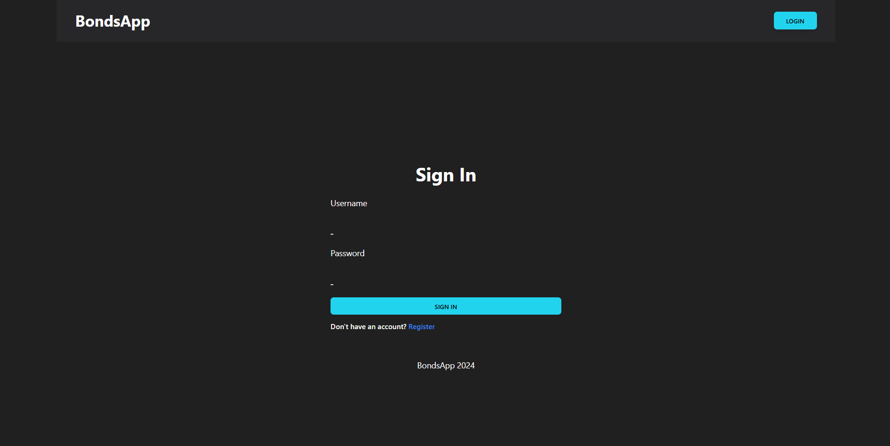
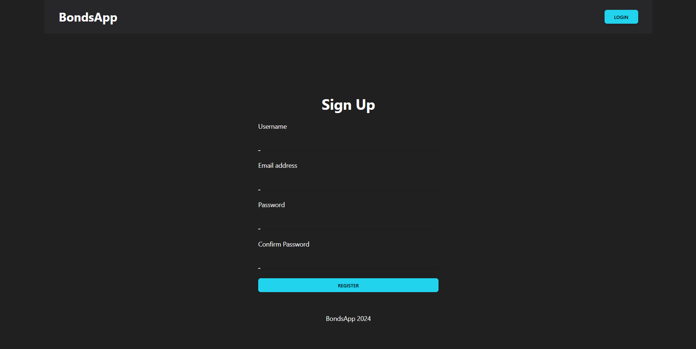
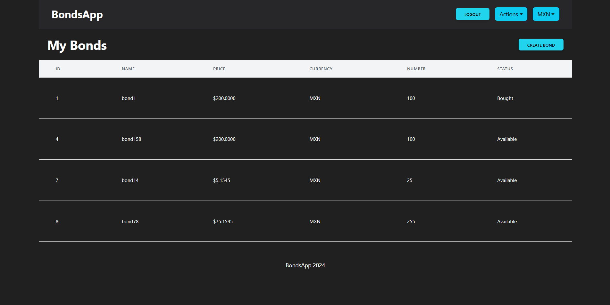
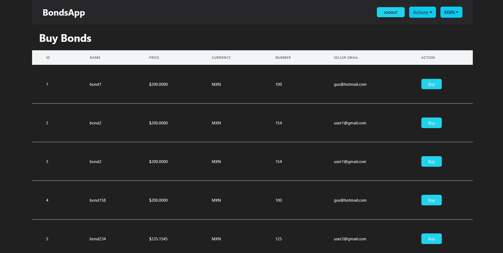
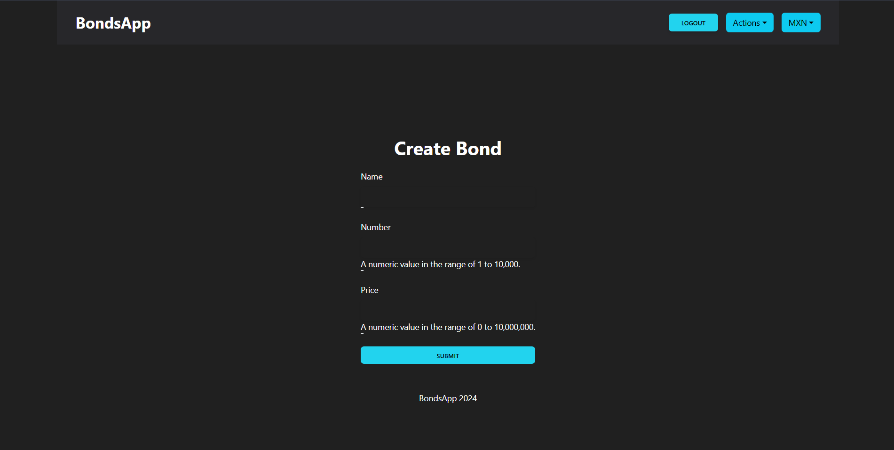

# Lenguajes ocupados: Pyhton, Node.js

# Instalacion BackEnd

## Primero activar el entorno virtual de venv y debesras posicionarte en BondsAPI-master y ejecutar los siguientes cocmandos

  - python -m pip install Django
  - python -m pip install django-cors-headers
  - python -m pip install djangorestframework
  - python -m pip install coreapi-cli
  - python -m pip install djangorestframework-simplejwt

### Una vez hayas terminado podras ejercutar el comando: *python manage.py runserver* el cual ejecutara un servidor local en el puerto *http://127.0.0.1:8000/* donde tendras acesos a los links de las operaciones
  
  - http://127.0.0.1:8000/bonds/bonds/
  - http://127.0.0.1:8000/bonds/users/
  - http://127.0.0.1:8000/bonds/login/
  - http://127.0.0.1:8000/bonds/register/
  - http://127.0.0.1:8000/bonds/logout/
  - http://127.0.0.1:8000/bonds/usd-price/

### A continuacion se instalara la parte del FrontEnd para eso deberas ingresar a las carpeta client para ejecutar los siguientes comandos

  - npm install
  - npm install bootstrap@5.3.3
  - npm install --save react-toastify
  - npm install react-bootstrap bootstrap@4.6.0

### Con esto se ha finalizado la instalacion del FrondEnd por lo tanto podras ejecutar el comando *npm run dev* y poder ver el otro servidor local que estara comunicado en el BackEnd en el puerto *http://localhost:5173/signin* donde podras ingresar a los siguientes links con las credenciales necesarias.

  - http://localhost:5173/signin
  - http://localhost:5173/signup
  - http://localhost:5173/my
  - http://localhost:5173/buy

# Imagenes demostrativas del interfaz proyecto

